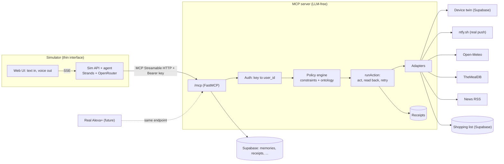

# Architecture — ContextForge v3 ("Verified Actions")

One Node process serves `/mcp`, `/health`, `/health/deep`, `/sim/*`, and the
static frontend (`server.getApp()` = Hono; proven in spikes S1–S3). Folders
stay separate (`src/` vs `simulator/`); only the process is shared.

## Request lifecycle (action tool)

1. `authenticate`: Bearer `cf_…` -> sha256 -> `api_keys` -> `{ userId, mode }`.
   Null -> 401. Tools fail closed on missing session.
2. `runAction`: idempotency check (sha256 of user|mode|tool|args|minute) ->
   policy `evaluate()` (block -> `blocked` + reasons; confirm/high-risk ->
   `needs_confirmation` + single-use arg-bound token) -> `adapter.write()` ->
   bounded read-back poll -> one idempotent retry -> `say` template -> receipt
   (`decision`, `expectation`, `observed`, `outcome`, `attempts`, latency).
3. Baseline mode returns the raw ack (`ok`) — the control for the A/B.

## Key files

- `src/core/`: `constraints.ts` (Zod union) · `policy.ts` (`evaluate()`) ·
  `matcher.ts` + `ontology/` (EU-14, diets, negation/compounds/qualifiers,
  severe fail-closed) · `verify.ts` (`runAction`) · `say.ts` · `result.ts` ·
  `receipts.ts`
- `src/adapters/`: `devices/twin.ts` (faults: none/lost_ack/delayed/offline/flaky,
  seeded) · `ntfy.ts` · `openmeteo.ts` · `mealdb.ts` (+ fallback) · `rss.ts` ·
  `lists.ts` · `http.ts` (timeout/retry/Zod)
- `src/tools/`: `memory.ts` · `accountability.ts` · `actions.ts` · `reads.ts` ·
  `context.ts` (session, envelope)
- `src/storage/`: `store.ts` (interface + `MemoryStore`) · `supabaseStore.ts` ·
  `memories.ts` (typed loads, poisoning guard)
- `simulator/api/`: `guest.ts` (keys + budget) · `agent.ts` (Strands, SSE event
  map) · `routes.ts` (`/sim/guest|chat|truth|faults`)
- `bench/`: `run.ts` (L1 oracle) · `llm.ts` (L2 scaffold) · `report.ts` ·
  `data/recipes.labeled.json` (60, hand-labelled)

Honest limits: the server controls what the *tool* says and records, not what
Alexa+ says after — hence verbatim `say`, server `instructions`, and receipts.
Twin devices are simulated; the verification pipeline is real and works
against any adapter. Ingredient matching is heuristics, not medical advice.
